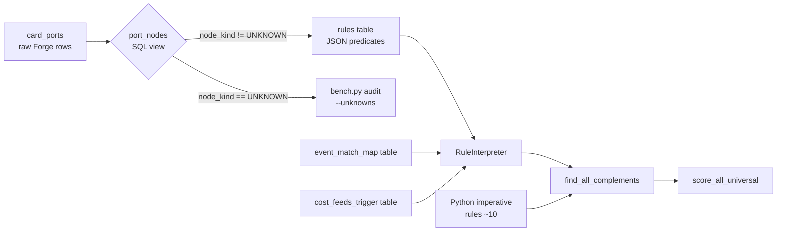

# feat: Typed Port-Graph Substrate + Rule-Interpreter POC

## Overview

Build the data-layer substrate the brainstorm calls for:

1. A closed canonical vocabulary of port-node kinds (FR1).
2. A `port_nodes` SQL projection over `card_ports` with typed columns (FR2).
3. `event_match_map` + `cost_feeds_trigger` as first-class tables whose
   rows replace the hand-authored Python dicts in `graph_engine.py`
   (FR3).
4. A `rules` table and a single `RuleInterpreter` that consumes data
   rows and produces `PortComplement` records (FR4, FR5).
5. `bench.py audit --unknowns` for surfacing novel Forge port shapes
   (FR7).
6. A **2-rule proof-of-concept migration**: `cascade_tribal` first (the
   brainstorm-designated easy target), then the 16 remaining keyword-
   tribal / replacement-stack generated rules collapsed into a single
   parameterized `peer_tribal_keyword` data row. Both under bitwise-
   identity gate.

**Scope is explicitly phased** — this plan lands the substrate and
proves the interpreter works on real rules. The full 30-rule migration
(FR8) and `scaffold_rule.py` rewrite (FR9) are deferred to a follow-up
plan gated on this one producing a green `bench.py audit
--expect-identity` after the POC migrations.

## Problem Frame

The current rule corpus is ~2,500 LOC of hand-authored Python across
40+ complement rules. Two structural failures follow (see origin):

1. **Rule-as-code** blocks declarative analysis. Adding a rule, tuning
   a gate, or merging collinear rules is a Python PR with imports,
   exports, and registry wiring. No SQL or analysis tool can inspect
   the rule corpus.
2. **`EVENT_MATCH_MAP` and `COST_FEEDS_TRIGGER` live only in Python**,
   so future rule-mining, the bench.py collinearity detector, and
   any unknown-port observability can't touch the equivalence graph.

The fix isn't mechanical — it's architectural. Project ports into a
small canonical vocabulary, materialize the equivalence maps as
tables, let rules be rows. One interpreter then replaces 30 Python
helpers, and future rules are data commits, not code commits.

(see origin: `docs/brainstorms/2026-04-21-typed-port-graph-requirements.md`)

## Requirements Trace

- **R1** (origin FR1) — Canonical vocabulary: closed, versioned set
  of `node_kind` values. Initial list: `ETB`, `LTB`, `DIES`, `CAST`,
  `RESOLVE`, `ATTACK`, `BLOCK`, `PAYMANA`, `TAP`, `UNTAP`,
  `COUNTER_PLACED`, `COUNTER_REMOVED`, `SACRIFICE`, `DISCARD`,
  `DRAW`, `DAMAGE`, `LIFE_CHANGE`, `ZONECHANGE`, `STATIC_BUFF`,
  `STATIC_REPLACEMENT`, `SCALES_WITH`.
- **R2** (origin FR2) — `port_nodes` SQL view projecting every row
  in `card_ports` to `(card_name, node_kind, subkind,
  valid_filter_bag, amount_expr, zone_origin, zone_destination,
  counter_type, tribe_token, color_token, ...)`. Unmapped rows get
  `node_kind = 'UNKNOWN'` with `subkind` preserving the raw
  `(port_type, event_class)`.
- **R3** (origin FR3) — `event_match_map` and `cost_feeds_trigger`
  become SQLite tables whose rows are
  `(from_node_kind, to_node_kind, match_quality)`. The Python
  constants become thin loaders that read the tables at import.
- **R4** (origin FR4) — `rules` table holds declarative rule rows
  with `rule_id`, `family`, `gate_predicate JSON`,
  `commander_port_predicate JSON`, `candidate_port_predicate JSON`,
  `filter_group`, `cmdr_event`, `cand_event`, `weight_hint`,
  `active`.
- **R5** (origin FR5) — Single `RuleInterpreter` class loads the
  `rules` table at process start, compiles predicates to SQL
  fragments + optional Python guards, exposes the same
  `find_all_complements()` interface the registry currently provides.
- **R6** (origin FR6) — Imperative escape hatch. The ~10
  hand-authored rules (voltron, monarch_synergy, wheel_synergy,
  flicker_synergy, creatures_as_lands_landfall, panharmonicon
  specializations, etc.) stay in Python. The registry composes
  declarative + imperative rules at the `find_all_complements()`
  boundary.
- **R7** (origin FR7) — `bench.py audit --unknowns` groups rows with
  `node_kind = 'UNKNOWN'` by `subkind`, emitting a Markdown table
  ranked by `(distinct_cards × sum_edhrec_rank_weight)`.
- **R8** (origin identity guardrail) — After the POC migrations in
  this plan, `bench.py audit --expect-identity` reports bitwise-
  identical per-(commander, candidate) scores on the pinned
  fixture.
- **R9** (scope boundary) — Every implementation unit is reversible
  via a feature flag or row-level toggle (`rules.active`), so a
  regression in one rule doesn't block the plan from landing.

## Scope Boundaries

- **No rewriting of imperative rules.** The ~10 Python rules stay.
- **No scoring-semantic changes.** Post-landing, `bench.py audit
  --expect-identity` must be bitwise-identical on the golden set.
- **No new port extractions.** The existing `ports.py` / `card_ports`
  output is the input to the projection. `ports.py` is not modified.
- **No ML / learned rule weights** — out of scope for this brainstorm.
- **No rule-mining.** That is Survivor 4 in the ideation doc.

### Deferred to Separate Tasks

- **Full rule migration (FR8 at scale).** Migrating the remaining ~28
  rules from Python to `rules` rows. Will be a follow-up plan gated
  on this one landing green and the interpreter proving expressive
  enough on the 2-rule POC.
- **`scaffold_rule.py` rewrite (FR9).** Make the scaffolder emit data
  rows instead of Python. Trivially follows the interpreter's stable
  row schema — becomes a 30-line generator once FR8 is done. Follow-
  up plan.
- **`card_hints` as declarative rule (origin open question).** Re-
  visit once FR8 has landed. Not blocking.
- **Survivor 4 (rule-mining / BoosterDraftAI / precon mining).** This
  plan only provides the substrate; mining lives in its own plan.

## Context & Research

### Relevant Code and Patterns

- `src/mtg_synergy_graph/graph_engine.py` — `EVENT_MATCH_MAP`
  (lines ~75-111) and `COST_FEEDS_TRIGGER` (lines ~116-127) are the
  dicts that become tables in Unit 3. `match_event()` at line ~130
  is the single caller; it becomes a table-driven lookup.
- `src/mtg_synergy_graph/complement_rules/core.py` — hosts
  `COMPLEMENT_RULES` tuple (9 classical rules, see lines 601-668)
  and the `PortComplement` dataclass (lines 676-686). Declarative
  rows in the new `rules` table emit `PortComplement` records
  shape-identical to what the Python helpers produce today.
- `src/mtg_synergy_graph/complement_rules/registry.py` — `RULE_GATES`
  registers the 40+ rules' gate predicates. The interpreter builds
  on this pattern — every declarative row gets auto-registered via
  its `gate_predicate JSON` without needing a hand-authored
  `_foo_gate()` helper.
- `src/mtg_synergy_graph/complement_rules/generated/cascade_tribal.py`
  — 69 LOC POC target. The rule's entire behavior is:
  `gate: port_type=keyword AND event_class='Cascade'` →
  `match: candidates with the same keyword port`. Declaratively
  expressible as 1-2 JSON predicates.
- `src/mtg_synergy_graph/complement_rules/generated/*.py` —
  16 other tribal / replacement-stack rules with the same shape
  (different keyword). Perfect second-POC target: 17 Python files →
  1 parameterized `peer_tribal_keyword` rule row per keyword (17
  data rows, 0 Python files).
- `src/mtg_synergy_graph/bench/` — harness shipped by plan 001.
  Already owns `bench.py audit` + subcommand dispatch, tensor
  persistence, and `--expect-identity`. The `--unknowns` subcommand
  (R7) slots in via the existing `handlers.py` + `cli.py` registration
  pattern.
- `src/mtg_synergy_graph/db.py` / `schema.sql` — where the new
  tables and view live. Existing `rule_contributions` table is the
  pattern for a plan-added SQLite table.

### Institutional Learnings

- `memory/feedback_audit_every_change.md` — every scoring-path
  change is audit-gated. This plan is purely identity-preserving
  substrate, but each unit still runs the gate.
- `memory/feedback_no_individual_rules.md` — "don't add game rules
  one-by-one; need general mechanical understanding." This plan IS
  the structural response to that feedback. The POC's second rule
  (17 tribal rules → 1 parameterized row) demonstrates the payoff
  concretely.
- `feedback_audit_metric_too_coarse.md` — use per-commander NDCG
  deltas, not just aggregate. Applies to the POC migrations: run
  `bench.py audit --rule <rule_id>` on each migrated rule after it
  lands, not just the aggregate audit.
- **Plan 002 (BM25F/conditional)** finding: scoring-formula reforms
  can be HARMFUL even when theoretically sound. Lesson for this
  plan: keep every migration strictly identity-preserving, never
  tune rule weights or gates during migration. If identity can't
  hold, revert the migration — don't merge "mostly equivalent."

### External References

Skipping external research. The patterns here (relational rule
engines, data-driven DSLs, canonical event vocabularies) are well-
understood in the team's head from prior iterations, and the origin
doc captures the intent with sufficient precision.

## Key Technical Decisions

- **`port_nodes` is a SQL view**, not a materialized table.
  Rationale: 108k ports × <10 JOIN cost per query ≈ bounded; no
  invalidation logic needed when the importer refreshes
  `card_ports`. If profiling shows a regression > 20% on
  `bench.py audit`, revisit as a materialized table with a
  re-import trigger.
- **Canonical vocabulary committed upfront as a versioned Python
  module constant.** `src/mtg_synergy_graph/port_graph/vocabulary.py`
  exports `NODE_KINDS: frozenset[str]` and `VOCAB_VERSION: str`.
  Schema migrations bump the version. This gives a single source of
  truth to the view (Unit 2), the tables (Unit 3), the rules schema
  (Unit 4), the interpreter (Unit 5), and the `--unknowns` reporter
  (Unit 6).
- **`event_match_map.match_quality` is an enum of ~5 values.**
  The original `EVENT_MATCH_MAP` uses Python lambdas (e.g., the
  `ChangesZone → Token` row checks `zone_destination`). Pure JSON
  can't carry arbitrary code. The plan enumerates the predicates:
  `always`, `zone_compatible`, `counter_compatible`, `tribe_match`,
  `color_match` — the set empirically covers every current lambda
  in `graph_engine.EVENT_MATCH_MAP`. The interpreter keeps a small
  dispatch table keyed on `match_quality`. Any NEW predicate needed
  by a future event pair requires adding a name + interpreter case
  and bumping `VOCAB_VERSION`.
- **`gate_predicate` / `commander_port_predicate` /
  `candidate_port_predicate` are JSON trees.** Shape:
  `{"op": "and" | "or" | "not", "args": [...]}` with leaf ops like
  `{"op": "has_port", "port_type": "keyword", "event_class":
  "Cascade"}` and `{"op": "filter_tag", "tag": "YouCtrl"}`. Tree
  over flat because rule predicates naturally nest (e.g., an
  axis-feeder wants `port_type=scales_with AND valid_filter
  contains counters_GE_*`). No new abstraction — same shape as the
  ElasticSearch query DSL or JSON Logic; the interpreter compiles
  each subtree to a SQL `WHERE` fragment + Python-side filter.
- **Interpreter compiles predicates at import, not per-call.** At
  module load (`RuleInterpreter.__init__`) each rule's JSON is
  walked once and cached as `(sql_fragment, parameters, python_guard)`.
  Per-commander cost is a prepared-statement execution plus the
  Python guard, matching the current per-rule Python helper's
  performance envelope.
- **POC migration sequence: `cascade_tribal` first, then
  `peer_tribal_keyword`.** Cascade is 69 LOC with the simplest
  possible shape (gate + DISTINCT query on one column). Landing it
  green proves the dispatch + interpreter + identity gate all work.
  The peer_tribal_keyword family then validates the parameterization
  claim (17 rules → 17 data rows of the same row-type) before any
  hand-authored rule is touched.
- **No rule weights are tuned during migration.** Each migrated
  row inherits the existing `_RULE_QUALITY_MULTIPLIER` / 
  `_FLAT_WEIGHT_OVERRIDES` entry via the interpreter's `weight_hint`
  column. Identity under `bench.py audit --expect-identity` is the
  gate.
- **Registry coexistence strategy.** During migration, declarative
  rules and Python-helper rules coexist behind the single
  `find_all_complements()` entry point. The registry knows which
  rule_ids are declarative (via a `DECLARATIVE_RULE_IDS` frozenset
  that grows each migration) and dispatches accordingly. Once a
  rule migrates, its Python helper is deleted in the same commit.

## Open Questions

### Resolved During Planning

- **Plan scope: phased or single?** — Resolved phased. This plan
  lands substrate + 2-rule POC. Full migration is a follow-up plan.
- **Canonical vocabulary source of truth?** — Resolved. Python
  module constant (`vocabulary.py`) committed alongside the view.
- **`port_nodes` storage?** — Resolved. SQL view. Revisit only on
  profiled regression.
- **`gate_predicate` JSON shape?** — Resolved. Tree of
  `{"op": ..., "args": [...]}` with leaf-op vocabulary `has_port`,
  `filter_tag`, `zone_eq`, `counter_type`, `tribe`, etc. Evolves
  additively.
- **`event_match_map` predicate vocabulary?** — Resolved. Enum of
  `always`, `zone_compatible`, `counter_compatible`,
  `tribe_match`, `color_match`. Interpreter has a small dispatch
  table; new predicates need a vocab-version bump.
- **POC rule selection?** — Resolved. `cascade_tribal`
  (brainstorm-designated) first, then `peer_tribal_keyword` family
  (17 rules → 17 data rows).

### Deferred to Implementation

- **Exact column set on `port_nodes`.** The brainstorm lists
  `valid_filter_bag`, `amount_expr`, `zone_origin`,
  `zone_destination`, `counter_type`, `tribe_token`, `color_token`,
  `...`. The exact set is known only once the 2-rule POC actually
  exercises the projection. Add columns as needed during Unit 2/7;
  don't pre-design for rules that aren't migrating yet.
- **How the interpreter caches compiled SQL fragments across
  commanders.** Likely a module-global dict keyed on `rule_id` with
  the prepared-statement object. Pin the choice in Unit 5 once
  profiling against a single commander is observable.
- **Whether the `UNKNOWN` projection preserves `valid_filter`
  verbatim or a normalized form.** Depends on what the
  `--unknowns` CLI output actually needs to surface for a human to
  classify. Decide in Unit 6.
- **Test-file layout for declarative rules.** Each migrated rule
  currently has `tests/test_<rule>.py` exercising the Python
  helper. When the helper is deleted, those tests stay (now
  exercising the interpreter's output for that `rule_id`) or get
  consolidated into one `tests/test_rule_interpreter.py` per
  family. Decide per-rule in Units 7/8 based on what's clearer.

## Output Structure

```text
src/mtg_synergy_graph/
├── port_graph/                             # (new package)
│   ├── __init__.py
│   ├── vocabulary.py                        # NODE_KINDS, VOCAB_VERSION
│   ├── projection.py                        # port_nodes view builder
│   ├── event_maps.py                        # loaders that read
│   │                                          event_match_map /
│   │                                          cost_feeds_trigger tables
│   └── interpreter.py                       # RuleInterpreter class
├── schema.sql                               # (modified)
│                                              + port_nodes view
│                                              + event_match_map table
│                                              + cost_feeds_trigger table
│                                              + rules table
├── graph_engine.py                          # (modified) EVENT_MATCH_MAP
│                                              and COST_FEEDS_TRIGGER become
│                                              table-backed loaders
└── complement_rules/
    ├── registry.py                          # (modified) knows
    │                                          DECLARATIVE_RULE_IDS and
    │                                          routes accordingly
    └── generated/                           # (17 files deleted in Unit 8)

src/mtg_synergy_graph/bench/
├── handlers.py                              # (modified) + handle_unknowns
└── cli.py                                   # (modified) + --unknowns

data/
├── rules_seed.json                          # (new) declarative rules
│                                              committed to the repo
└── event_match_seed.json                    # (new) event-map rows

tests/
├── test_port_graph_vocabulary.py            # (new)
├── test_port_graph_projection.py            # (new) port_nodes view
├── test_event_match_map_table.py            # (new) table ↔ Python parity
├── test_rule_interpreter.py                 # (new)
├── test_rules_migration_cascade.py          # (new) POC identity
├── test_rules_migration_peer_tribal.py      # (new) POC identity
└── bench/
    └── test_handle_unknowns.py              # (new) --unknowns CLI
```

## High-Level Technical Design

> *This illustrates the intended shape of the substrate. Directional
> guidance for review, not implementation specification. The
> implementing agent should adapt the exact JSON shapes, SQL view
> columns, and interpreter internals based on what the POC migration
> actually exercises.*

### Rule-flow diagram



### `rules` row sketch (directional)

```text
rule_id:                   cascade_tribal
family:                    tribal
gate_predicate JSON:       {"op": "has_port",
                             "port_type": "keyword",
                             "event_class": "Cascade"}
commander_port_predicate:  {"op": "has_port",
                             "port_type": "keyword",
                             "event_class": "Cascade"}
candidate_port_predicate:  {"op": "has_port",
                             "port_type": "keyword",
                             "event_class": "Cascade"}
filter_group:              ""
cmdr_event:                "cascade_tribal"
cand_event:                "same_keyword_partner"
weight_hint:               2.0
active:                    1
```

A `peer_tribal_keyword` row family has the same shape with the
keyword varying per row (17 rows for the current tribal set).

## Implementation Units

- [ ] **Unit 1: Canonical vocabulary module + versioning**

**Goal:** Commit the closed set of `node_kind` values as a Python
module constant so every downstream unit depends on a single source
of truth. No runtime behavior change.

**Requirements:** R1

**Dependencies:** None

**Files:**
- Create: `src/mtg_synergy_graph/port_graph/__init__.py`
- Create: `src/mtg_synergy_graph/port_graph/vocabulary.py`
- Test: `tests/test_port_graph_vocabulary.py`

**Approach:**
- `vocabulary.py` exports `NODE_KINDS: frozenset[str]` with the 21
  kinds from FR1, plus `VOCAB_VERSION: str = "1"`.
- Also exports `MATCH_QUALITIES: frozenset[str]` with the 5
  predicate names from Key Technical Decisions.
- Also exports leaf-op vocabulary for `gate_predicate` JSON:
  `GATE_OPS: frozenset[str]` with `has_port`, `filter_tag`,
  `zone_eq`, `counter_type`, `tribe`, `color`, `and`, `or`, `not`.
- `__init__.py` re-exports from vocabulary only (empty for now).

**Patterns to follow:**
- `src/mtg_synergy_graph/heuristics.py` — pattern for
  module-constant frozen sets at repo scope.
- `src/mtg_synergy_graph/complement_rules/core.py:COMPLEMENT_RULES` —
  pattern for closed, versioned, repo-wide tuples.

**Test scenarios:**
- Happy path: `NODE_KINDS` is a frozenset of exactly the 21 values
  from FR1; each value is a non-empty string with no whitespace.
- Happy path: `MATCH_QUALITIES` is a frozenset of 5 values;
  `VOCAB_VERSION` is a non-empty string.
- Edge case: vocabulary constants are importable without side
  effects (no DB touch, no file IO, idempotent on re-import).

**Verification:**
- `pytest tests/test_port_graph_vocabulary.py -q` green.
- `from mtg_synergy_graph.port_graph import vocabulary` works.

---

- [ ] **Unit 2: `port_nodes` view + schema**

**Goal:** Add a SQL view that projects every `card_ports` row to a
`node_kind`-typed row with the brainstorm's attribute columns.
Unmapped rows get `node_kind='UNKNOWN'` with the raw
`(port_type, event_class)` preserved in `subkind`.

**Requirements:** R2

**Dependencies:** Unit 1 (vocabulary)

**Files:**
- Modify: `src/mtg_synergy_graph/schema.sql` — add `port_nodes`
  view DDL.
- Create: `src/mtg_synergy_graph/port_graph/projection.py` —
  helpers for view creation (DDL text) and UNKNOWN classification.
- Test: `tests/test_port_graph_projection.py`

**Approach:**
- The view's SELECT case-expression-maps each
  `(port_type, event_class)` into a `node_kind` from `NODE_KINDS`.
  Example: `(port_type='trigger', event_class='ChangesZone',
  zone_destination='Battlefield') → 'ETB'`. Every mapping is one
  CASE branch; add mappings as the POC rules demand.
- Anything falling through the CASE gets `'UNKNOWN'` with
  `subkind = port_type || '.' || event_class`.
- Columns (v1): `card_name`, `node_kind`, `subkind`,
  `valid_filter` (verbatim from card_ports), `zone_origin`,
  `zone_destination`, `amount_expr`, `counter_type` (extracted
  when applicable), `raw_line`. Add more columns in Units 7/8 as
  the POC rules need.
- `projection.py` hosts the DDL as a multi-line string constant so
  the same text is used by `schema.sql`, tests, and the `--unknowns`
  reporter.

**Execution note:** Characterization-first — before adding any
CASE branch, add a test that counts `SELECT COUNT(*) FROM
port_nodes WHERE node_kind='UNKNOWN'` and freezes the number on
the baseline DB. Every CASE branch added should strictly decrease
that count.

**Patterns to follow:**
- `src/mtg_synergy_graph/schema.sql` — existing `rule_contributions`
  table DDL; same placement + style.
- `src/mtg_synergy_graph/db.py:open_db` — schema-apply pattern.

**Test scenarios:**
- Happy path: on a minimal fixture with one `trigger.ChangesZone`
  port, `port_nodes` has one row with `node_kind='ETB'` (or the
  mapped kind — exact mapping decided during implementation).
- Happy path: a `cost.tap` port projects to `node_kind='TAP'`.
- Edge case: port with `event_class=''` or `port_type=''`
  projects to `node_kind='UNKNOWN'` with `subkind` preserving
  the empty fields.
- Edge case: a brand-new `event_class` not in any CASE branch
  projects to `UNKNOWN` with the raw class in `subkind`.
- Integration: on the production `data/synergy.db`, the COUNT of
  non-UNKNOWN rows is > 0 and the set of distinct
  `node_kind` values is a subset of `NODE_KINDS`. Additional
  CASE branches are added iteratively until every `node_kind`
  actually used by the POC rules is mapped.

**Verification:**
- `pytest tests/test_port_graph_projection.py -q` green.
- `sqlite3 data/synergy.db "SELECT node_kind, COUNT(*) FROM port_nodes GROUP BY 1"` returns rows with `UNKNOWN` count that is smaller than `SELECT COUNT(*) FROM card_ports`.
- No change to `bench.py audit --expect-identity` — the view is
  observability-only at this stage; scoring still reads `card_ports`.

---

- [ ] **Unit 3: `event_match_map` + `cost_feeds_trigger` tables + loaders**

**Goal:** Move `graph_engine.EVENT_MATCH_MAP` and
`COST_FEEDS_TRIGGER` into first-class SQLite tables. The Python
constants become thin loaders that read the tables at module import.
`match_event()` semantics preserved bitwise.

**Requirements:** R3, R8 (identity)

**Dependencies:** Unit 1 (for `MATCH_QUALITIES`)

**Files:**
- Modify: `src/mtg_synergy_graph/schema.sql` — two new tables.
- Create: `src/mtg_synergy_graph/port_graph/event_maps.py` — load
  functions `load_event_match_map()`, `load_cost_feeds_trigger()`.
- Modify: `src/mtg_synergy_graph/graph_engine.py` — `EVENT_MATCH_MAP`
  and `COST_FEEDS_TRIGGER` become module-level values populated by
  the loaders at import. `match_event()` keeps its signature.
- Create: `data/event_match_seed.json` — seed rows committed to the
  repo, loaded by the importer so fresh DBs populate the tables.
- Modify: `src/mtg_synergy_graph/importer.py` — seed the two tables
  from the JSON on DB create.
- Test: `tests/test_event_match_map_table.py` — table ↔ Python
  parity.

**Approach:**
- Table shape (v1):
  `event_match_map(from_node_kind TEXT, to_node_kind TEXT,
  match_quality TEXT, PRIMARY KEY (from_node_kind, to_node_kind))`.
  Row count ≈ 30 (sum over existing EVENT_MATCH_MAP nested keys).
- Every existing lambda in `EVENT_MATCH_MAP` maps to one of the 5
  predicate names. The interpreter dispatches by `match_quality`.
- Seeding: committed JSON file, loaded by the importer on DB
  create. Runtime never writes to these tables; they are a
  read-only snapshot of the Python constants at the time of
  seeding. `bench.py audit --expect-identity` gates any seed
  change.
- Test parity: for every (from, to) pair in both representations,
  verify that `match_event()` returns the same boolean on a
  representative trigger+effect port.

**Execution note:** Characterization-first — write a table-vs-
Python parity test that iterates every (from, to) pair and freezes
`match_event()` output on canary port rows. Only then refactor the
Python loader to read from the table.

**Patterns to follow:**
- `src/mtg_synergy_graph/importer.py` — seed pattern for fixtures.
- `scripts/import_cardsfolder.py` — DB-creation sequencing.

**Test scenarios:**
- Happy path: loaded `EVENT_MATCH_MAP` is structurally equivalent
  to the pre-change Python dict (same keys, same inner keys, same
  `match_quality` classification).
- Happy path: `match_event(trigger_row, effect_row)` returns the
  same boolean for every (trigger, effect) pair currently exercised
  by `tests/test_ports.py` and `tests/test_scope_compat.py`.
- Edge case: adding a row to `data/event_match_seed.json` that
  isn't in the Python dict triggers a parity-test failure (the
  test catches drift between the two representations during
  migration).
- Integration: `bench.py audit --expect-identity` on the pinned
  fixture PASS after refactor. Identical aggregate NDCG, identical
  per-(cmdr, cand) scores.

**Verification:**
- Parity tests green on every pair in both representations.
- `bench.py audit --expect-identity` PASS.
- `graph_engine.py` exports look identical to callers (no API
  shape change).

---

- [ ] **Unit 4: `rules` table schema + seed-loader infrastructure**

**Goal:** Add the `rules` table and the seed-from-JSON mechanism.
No rules are migrated yet — this unit is pure schema + infra.
Identity preserved because the interpreter doesn't exist yet.

**Requirements:** R4

**Dependencies:** Unit 1 (for `GATE_OPS`)

**Files:**
- Modify: `src/mtg_synergy_graph/schema.sql` — `rules` table DDL.
- Create: `data/rules_seed.json` — starts empty (migrated rules
  land here in Units 7/8).
- Modify: `src/mtg_synergy_graph/importer.py` — seed the `rules`
  table from `rules_seed.json` on DB create.
- Create: `src/mtg_synergy_graph/port_graph/rules_schema.py` —
  dataclass `RuleRow` mirroring the table + JSON-validation helper
  (`validate_gate_predicate(json)` using `GATE_OPS` from Unit 1).
- Test: `tests/test_rules_schema.py` — schema + validator.

**Approach:**
- Table shape: `rules(rule_id TEXT PRIMARY KEY, family TEXT,
  gate_predicate TEXT, commander_port_predicate TEXT,
  candidate_port_predicate TEXT, filter_group TEXT, cmdr_event
  TEXT, cand_event TEXT, weight_hint REAL, active INTEGER)`.
  JSON columns stored as TEXT; validator runs at load time.
- `RuleRow` is a `@dataclass(frozen=True)` view over a single row.
- `validate_gate_predicate(json_text)` parses the JSON and walks
  the tree; every node must have `op` in `GATE_OPS`; every leaf
  op has a fixed required-field set. Raises `ValueError` on
  violation with a pointer to the offending subtree.
- No runtime-side code (interpreter) — that's Unit 5.

**Execution note:** Test-first on the validator — it's pure logic
with well-defined inputs/outputs.

**Patterns to follow:**
- `src/mtg_synergy_graph/bench/fixture.py` — JSON schema validation
  and error shapes; `PinnedFixture` treats the JSON file as a
  tracked artifact.
- `src/mtg_synergy_graph/universal_scorer.py:ScoringConfigInputs` —
  `NamedTuple` / `@dataclass(frozen=True)` view over a live state
  for testability.

**Test scenarios:**
- Happy path: a valid `gate_predicate` tree parses without error.
  Example: `{"op": "has_port", "port_type": "keyword",
  "event_class": "Cascade"}` parses.
- Happy path: a compound tree with nested `and` / `or` parses.
- Edge case: JSON with `op` not in `GATE_OPS` raises `ValueError`
  mentioning the unknown op.
- Edge case: `has_port` leaf missing `port_type` raises with the
  offending subtree printed.
- Error path: malformed JSON (truncated, non-JSON text) raises
  `ValueError` with the parse offset.
- Edge case: `rules_seed.json` with zero rows loads cleanly (empty
  table is valid).

**Verification:**
- `pytest tests/test_rules_schema.py -q` green.
- Fresh DB created by `importer.py` has an empty `rules` table.
- `bench.py audit --expect-identity` PASS (no runtime path
  changed).

---

- [ ] **Unit 5: `RuleInterpreter` class**

**Goal:** Compile rule-row JSON predicates into SQL fragments and
Python guards at interpreter init, then execute them to produce
`PortComplement` records. Exposes the same
`find_all_complements(conn, cmdr_set)` interface the registry
currently provides for its rule set.

**Requirements:** R5, R6 (escape hatch coexistence)

**Dependencies:** Units 1, 2, 3, 4

**Files:**
- Create: `src/mtg_synergy_graph/port_graph/interpreter.py` —
  `RuleInterpreter` class.
- Modify: `src/mtg_synergy_graph/complement_rules/registry.py` —
  `DECLARATIVE_RULE_IDS` frozenset (starts empty) + routing
  logic that sends declarative rule_ids to the interpreter while
  Python-helper rule_ids continue to use the current path.
- Modify: `src/mtg_synergy_graph/complement_rules/__init__.py` —
  `find_all_complements` composes both sources at the boundary
  (no API change to callers).
- Test: `tests/test_rule_interpreter.py` — synthetic rules rows
  driving the interpreter against an in-memory DB.

**Approach:**
- Interpreter load order:
  1. Read all active rules from the `rules` table.
  2. For each rule, parse `gate_predicate` / `commander_port_predicate`
     / `candidate_port_predicate` JSON into a tree of op-dataclasses.
  3. Compile each tree to a `(sql_where_fragment, params,
     python_guard)` triple, cached on the interpreter instance.
  4. On `find_all_complements`, iterate rules, run the cached SQL
     against the commander's ports (for gate + commander predicate),
     optionally filter via python_guard, then run the candidate
     predicate to generate the candidate set. Emit one
     `PortComplement` per match.
- Imperative escape hatch: the registry still owns hand-authored
  Python helpers; the interpreter is only called for `rule_id ∈
  DECLARATIVE_RULE_IDS`. Shape-identical `PortComplement` records
  mean the boundary between declarative and imperative is invisible
  to the scorer.
- Performance: one `sqlite3.prepare`-equivalent per compiled
  fragment (SQLite's auto-cache works fine here; no explicit
  `prepared` API in Python's stdlib driver). No per-candidate
  compilation.

**Execution note:** Test-first — the interpreter should be driven
only by synthetic in-memory DBs in Unit 5. Real-rule migration
happens in Unit 7.

**Patterns to follow:**
- `src/mtg_synergy_graph/complement_rules/generated/cascade_tribal.py`
  — reference implementation for the output shape. The interpreter
  must produce the same `PortComplement` records a handwritten
  helper would, for the same rule semantics.
- `src/mtg_synergy_graph/bench/collinearity.py` — pattern for
  iterating rules from a declarative data structure and emitting
  analytic output.

**Test scenarios:**
- Happy path: a minimal `has_port` rule on a 2-card fixture emits
  one `PortComplement` with the correct `rule_id`, `cmdr_event`,
  `cand_event`, `filter_group`.
- Happy path: an `and` tree with two leaf ops correctly requires
  BOTH to match before emitting.
- Happy path: `or` emits on either match.
- Edge case: rule with `active = 0` is skipped entirely.
- Edge case: commander has no matching port — interpreter returns
  empty list, no spurious records.
- Edge case: `candidate_port_predicate` with `exclude_commander=True`
  skips cards in `cmdr_set` (matches current `cascade_tribal`
  behavior).
- Error path: rule with invalid predicate JSON is logged and
  skipped at load time rather than crashing the whole interpreter.
  (The load-time validator from Unit 4 should have caught this
  already, but defense-in-depth.)
- Integration: with `DECLARATIVE_RULE_IDS = frozenset()` (the
  default entering Unit 5), `find_all_complements` produces
  bitwise-identical output to the pre-Unit-5 state — the
  interpreter is loaded but contributes zero complements.

**Verification:**
- `pytest tests/test_rule_interpreter.py -q` green.
- `bench.py audit --expect-identity` PASS (interpreter present but
  no rules routed through it yet).

---

- [ ] **Unit 6: `bench.py audit --unknowns`**

**Goal:** New bench subcommand that groups `port_nodes` rows with
`node_kind = 'UNKNOWN'` by `subkind`, emitting a ranked Markdown
table. Closes the "ValidCards fallback took weeks to surface"
feedback loop.

**Requirements:** R7

**Dependencies:** Unit 2 (port_nodes view)

**Files:**
- Modify: `src/mtg_synergy_graph/bench/handlers.py` — new
  `handle_unknowns(args) -> int`.
- Modify: `src/mtg_synergy_graph/bench/cli.py` — register
  `--unknowns` as a new mutually-exclusive audit mode.
- Test: `tests/bench/test_handle_unknowns.py`.

**Approach:**
- SQL: `SELECT subkind, COUNT(DISTINCT card_name) AS distinct_cards,
  SUM(CASE WHEN c.edhrec_rank IS NULL THEN 0 ELSE 30001 - c.edhrec_rank END)
  AS rank_weight FROM port_nodes pn LEFT JOIN cards c ON pn.card_name =
  c.name WHERE node_kind = 'UNKNOWN' GROUP BY subkind ORDER BY
  rank_weight DESC`.
- Output: Markdown table with columns `subkind | distinct_cards |
  rank_weight | example_cards` (top 3 by rank).
- Exit code: 0 if any UNKNOWN rows exist (informational); the
  operator decides whether to act.

**Patterns to follow:**
- `src/mtg_synergy_graph/bench/handlers.py:handle_collinearity` —
  existing Markdown-emitting handler. Same shape.
- `src/mtg_synergy_graph/bench/cli.py` — handler table +
  `register()` pattern.

**Test scenarios:**
- Happy path: DB with 3 UNKNOWN-kind rows across 2 subkinds emits
  a table with 2 rows sorted by rank_weight.
- Edge case: DB with zero UNKNOWN rows emits "No unknown port
  shapes detected." and exits 0.
- Error path: `port_nodes` view missing (bad schema) — handler
  raises a clear error pointing the user to re-import.
- Integration: `scripts/bench.py audit --unknowns` runs
  end-to-end on `data/synergy.db`, prints output, exits 0.

**Verification:**
- `pytest tests/bench/test_handle_unknowns.py -q` green.
- Manual `scripts/bench.py audit --unknowns` on the production DB
  produces a non-crashing Markdown report.

---

- [ ] **Unit 7: POC migration 1 — `cascade_tribal` as declarative row**

**Goal:** Migrate `src/mtg_synergy_graph/complement_rules/generated/
cascade_tribal.py` to a single row in `data/rules_seed.json`.
Delete the Python file. Prove end-to-end identity.

**Requirements:** R4, R5, R8 (identity gate)

**Dependencies:** Units 1-5

**Files:**
- Delete: `src/mtg_synergy_graph/complement_rules/generated/cascade_tribal.py`
- Modify: `data/rules_seed.json` — add one row for `cascade_tribal`.
- Modify: `src/mtg_synergy_graph/complement_rules/registry.py` —
  add `cascade_tribal` to `DECLARATIVE_RULE_IDS`.
- Modify: `src/mtg_synergy_graph/complement_rules/generated/__init__.py` —
  drop the `cascade_tribal` import.
- Modify: `src/mtg_synergy_graph/universal_scorer.py:_RULE_TO_BUCKET` —
  no change (rule_id stays same) but verify entry is still correct.
- Test: `tests/test_rules_migration_cascade.py` — identity +
  interpreter parity with the deleted Python helper.
- Modify: `tests/test_generated_cascade_tribal.py` — either delete
  or rewrite to exercise the interpreter's output for
  `rule_id='cascade_tribal'` (decide during implementation based
  on what's clearer).

**Approach:**
- Derive the row from the Python helper:
  - `gate_predicate`: `{"op": "has_port", "port_type": "keyword",
    "event_class": "Cascade"}`.
  - `commander_port_predicate`: same as gate.
  - `candidate_port_predicate`: `{"op": "and", "args": [<same>,
    {"op": "not_in_commander_set"}]}`.
  - `cmdr_event`: `"cascade_tribal"`, `cand_event`:
    `"same_keyword_partner"`, `filter_group`: `""`.
  - `weight_hint`: 2.0 (matches current `_RULE_QUALITY_MULTIPLIER`
    entry).
- Run `bench.py audit --expect-identity`. Bitwise-identical is the
  landing gate. If it fails, either fix the predicate or revert
  the unit.
- Run `bench.py audit --rule cascade_tribal` — output should
  match the pre-migration numbers.

**Execution note:** Characterization-first — before deleting the
Python file, snapshot the pre-migration `PortComplement` list on a
cascade-commander fixture (e.g., Maelstrom Wanderer) and assert the
interpreter produces the same list byte-for-byte after.

**Patterns to follow:**
- `src/mtg_synergy_graph/complement_rules/generated/cascade_tribal.py`
  — the helper being replaced; its gate + query is the authoritative
  reference.
- `tests/bench/test_fixture_roundtrip.py` — the identity snapshot
  pattern for pinned fixtures.

**Test scenarios:**
- Happy path: on a Maelstrom Wanderer fixture, the interpreter
  emits the same set of `PortComplement(rule_id='cascade_tribal',
  ...)` records the deleted Python helper produced.
- Happy path: on a Non-cascade-commander fixture, no
  `cascade_tribal` complements are emitted (gate rejects).
- Edge case: commander-self exclusion works — Maelstrom Wanderer
  doesn't match itself.
- Edge case: Apex Devastator's 4-way Cascade ports deduplicate
  correctly (DISTINCT semantics match the old helper).
- Integration: `bench.py audit --expect-identity` PASS on the
  pinned fixture.
- Integration: `bench.py audit --rule cascade_tribal` shows the
  same aggregate contribution before and after migration.

**Verification:**
- All test scenarios above green.
- `bench.py audit --expect-identity` PASS.
- `src/mtg_synergy_graph/complement_rules/generated/cascade_tribal.py`
  no longer exists.
- Line count on the migration is net-negative (a deleted file + a
  JSON row).

---

- [ ] **Unit 8: POC migration 2 — 16 keyword/replacement-stack rules → 17 data rows**

**Goal:** Migrate the remaining 16 generated rules to data rows
using a parameterized `peer_tribal_keyword` shape. The rule_ids
stay identical (cascade_tribal, choose_tribal, melee_tribal,
etc.) so `_RULE_QUALITY_MULTIPLIER` and other lookups still work;
only the underlying dispatch changes. Deletes 16 files, adds 16
JSON rows, produces 0 behavioral change.

**Requirements:** R4, R5, R8 (identity gate), origin FR4/FR5 payoff
demo.

**Dependencies:** Unit 7 (proves 1-row migration works)

**Files:**
- Delete: `src/mtg_synergy_graph/complement_rules/generated/{changeling_tribal,choose_tribal,doctor_s_tribal,etbreplacement_copy_dbcopy_optional_tribal,etbreplacement_other_choosect_tribal,firebending_2_tribal,landwalk_island_tribal,melee_tribal,mentor_tribal,more_tribal,prowess_tribal,repl_damagedone_counters_stack,repl_moved_exile_stack,start_tribal,training_tribal}.py`
- Modify: `src/mtg_synergy_graph/complement_rules/generated/__init__.py` —
  remove all deleted imports.
- Modify: `src/mtg_synergy_graph/complement_rules/registry.py` —
  expand `DECLARATIVE_RULE_IDS` to include all 17 tribal rule_ids;
  drop the `RULE_GATES` entries for them (the interpreter supplies
  attribution now).
- Modify: `data/rules_seed.json` — 16 new rows (one per migrated
  rule) + the existing cascade row, all using the same JSON shape.
- Test: `tests/test_rules_migration_peer_tribal.py` — identity +
  parameterization correctness.

**Approach:**
- The 17 tribal/stack rules all share the shape:
  `gate = has_port(port_type=keyword, event_class=<KEYWORD>)`
  `match = same keyword across other cards`.
  The only differences are `<KEYWORD>` and one of two
  `replacement_result`-style subkinds for the two
  `repl_*_stack` rules. The JSON row varies only in these
  fields — parameterization by data is exactly what the brainstorm
  targets.
- Run `bench.py audit --expect-identity` after each batch of 3-5
  migrations. Staging reduces blast radius.
- The 16 deletions net out: 16 Python files + 16 import lines + 16
  `RULE_GATES` entries → 17 JSON rows + 1 declarative entry. LOC
  delta is strongly negative.

**Execution note:** Characterization-first per batch — freeze the
`PortComplement` output on a fixture commander per keyword before
deleting the Python file.

**Patterns to follow:**
- Unit 7's migration playbook.
- `data/rules_seed.json` after Unit 7 — one row per rule_id.

**Test scenarios:**
- Happy path: for each of the 16 migrated rules, the interpreter
  emits the same `PortComplement` records as the deleted Python
  helper on an archetype-appropriate fixture commander (e.g., Mentor
  commanders for `mentor_tribal`).
- Edge case: `repl_moved_exile_stack` and
  `repl_damagedone_counters_stack` — these use replacement-port
  shape rather than keyword-port shape. Verify the parameterization
  extends to the second shape without a new predicate family, or
  document a second row-shape if needed.
- Integration: `bench.py audit --expect-identity` PASS after each
  batch commit.
- Integration: `bench.py audit --rule <rule_id>` matches
  pre-migration contribution for each migrated rule.
- Integration: file count delta is −16 Python files + 16 JSON
  rows; LOC delta is ~−750 LOC (each generated file is ~47 LOC).

**Verification:**
- All test scenarios green.
- `bench.py audit --expect-identity` PASS.
- `ls src/mtg_synergy_graph/complement_rules/generated/` returns
  only `__init__.py` (+ any remaining generated files that don't
  fit the tribal/stack shape).
- LOC reduction visible in commit stats.

## System-Wide Impact

- **Interaction graph.** `score_all_universal` still calls
  `find_all_complements`. The only seam that changes is inside
  the registry: declarative rule_ids route through the interpreter,
  Python-helper rule_ids route through their existing helpers.
  Scorer, tensor writer, bench audit, `recommend.py` — all
  unchanged. `bench.py audit --rule` still works per-rule because
  rule_ids are preserved.
- **Error propagation.** Two new surfaces:
  (1) Rule-load-time validation errors raise at interpreter init;
  operators see them on first `score_all_universal` call.
  (2) `port_nodes` view errors (missing column after a schema
  migration mismatch) surface on first query. Both fail-fast and
  loud.
- **State lifecycle risks.** The seed JSON files (`rules_seed.json`,
  `event_match_seed.json`) are committed artifacts; DB re-import
  reseeds from them. A stale DB (old seed loaded) + new seed JSON
  = hash mismatch at the tensor layer (config_hash should include
  the seed-JSON hash in a follow-up — see Unit 5's
  `DECLARATIVE_RULE_IDS` hook as the natural place).
- **API surface parity.** Public surfaces (`SynergyEngine.page`,
  `score_all_universal`, `find_all_complements`, `PortComplement`,
  `UniversalScore`, `TensorRow`, `TensorSink`) have no signature
  changes.
- **Integration coverage.** Every unit's verification includes a
  `bench.py audit --expect-identity` run against the pinned
  fixture — that's the one authoritative integration signal.
  Per-unit unit tests exercise new schema + interpreter behavior;
  they cannot by themselves prove end-to-end identity.
- **Unchanged invariants.** `_RULE_QUALITY_MULTIPLIER`,
  `_FLAT_WEIGHT_OVERRIDES`, `_SYNERGY_PAIRS` untouched. Scoring
  formulas (`_idf_legacy_global`, concentration dampening, pair
  bonuses, circuit bonus, cmc/rank bonuses) untouched. Rule
  ordering untouched (registry iteration order preserved — the
  interpreter's rules fire wherever their rule_ids currently fire
  in the ordering).

## Risks & Dependencies

| Risk | Mitigation |
|------|------------|
| The interpreter can't express some current rule's predicate in JSON (e.g., raw_line regex inspection for specific Forge SVar shapes). Migration stalls mid-rule. | Scope boundary: rule stays Python, moves to the imperative-escape-hatch list. The interpreter only needs to handle the 2-rule POC (cascade_tribal + tribal family); if the brainstorm's "~30 declaratizable" count drops to 25, that's still an 80% LOC win worth executing. Follow-up plan handles the long tail with fresh predicate ops added as needed. |
| `port_nodes` view is slower than direct `card_ports` queries for some per-commander scoring paths. | The view is used by the interpreter and by `--unknowns`. Scoring still reads `card_ports` unless a rule explicitly queries `port_nodes`. Time `bench.py audit` before/after Unit 2; if > 20% regression, revisit storage. |
| Table-driven `event_match_map` drifts from the Python constants during multi-person development. | Seed JSON is the single source of truth; Python constants are loaded FROM it. The parity test from Unit 3 catches drift on CI. |
| `DECLARATIVE_RULE_IDS` expansion accidentally double-fires a rule (both declarative and Python code paths emit). | Mitigation: registry routing is exclusive — a rule_id is EITHER declarative OR in the Python helper list. Validator at registry init raises `ValueError` if the same rule_id appears in both. |
| Bitwise-identity fails after POC migration because the interpreter's emission order differs from the Python helper's. | `PortComplement` records are accumulated in a list before scoring; scoring dedupes by `(rule_id, cmdr_event, cand_event, filter_group)`. Order doesn't affect scores, only tensor row emission order. Unit 5's test scenarios include the "unordered set equality" variant to catch this. |
| Schema migration on existing DBs — adding columns / tables requires a re-import, not a live ALTER. | All new tables are additive; existing DBs without them fail closed on interpreter init with a clear re-import message. The existing `open_db` already handles this (schema.sql is re-applied on every open). |

## Documentation / Operational Notes

- CLAUDE.md "Scoring Architecture" section grows a new subsection
  describing the interpreter and the declarative vs imperative
  boundary.
- `docs/RULE_PLANNING.md` updated to say that new rules in families
  covered by the interpreter should land as data rows in
  `data/rules_seed.json`, not new Python files. `scripts/scaffold_rule.py`
  still emits Python for families not yet covered; its rewrite is
  the follow-up plan's FR9.
- No deployment, monitoring, or rollout concerns — single-tenant
  CLI tool. All units are audit-gated; any unit that breaks
  `bench.py audit --expect-identity` is reverted.

## Sources & References

- **Origin document:** [docs/brainstorms/2026-04-21-typed-port-graph-requirements.md](../brainstorms/2026-04-21-typed-port-graph-requirements.md)
- **Prerequisite (shipped):** [docs/plans/2026-04-22-001-feat-unified-eval-harness-plan.md](2026-04-22-001-feat-unified-eval-harness-plan.md) — `bench.py audit --expect-identity` is the identity gate every unit depends on.
- **Related (abandoned):** `feat/idf-reforms-bm25f-conditional` local branch — plan 002 (BM25F + conditional denominator) landed as infrastructure only; its lesson (scoring changes can regress even when theoretically sound) informs this plan's strict identity-preservation policy.
- **Guardrail memory:** `memory/feedback_audit_every_change.md`, `memory/feedback_no_individual_rules.md`.
- **Code entry points:**
  - `src/mtg_synergy_graph/graph_engine.py:EVENT_MATCH_MAP`
  - `src/mtg_synergy_graph/complement_rules/core.py:COMPLEMENT_RULES`
  - `src/mtg_synergy_graph/complement_rules/registry.py:RULE_GATES`
  - `src/mtg_synergy_graph/complement_rules/generated/cascade_tribal.py`
  - `src/mtg_synergy_graph/bench/handlers.py`
