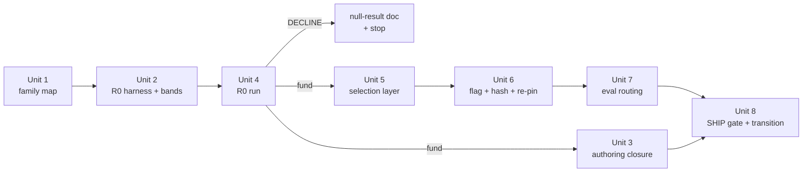

# feat: Portfolio Selection — Per-Family Diminishing Returns at Top-30 Assembly

> **DECISION 2026-07-02: DECLINED at the R0 kill-test (Unit 4).**
> Both 100-cmdr survivors failed the 500-cmdr R9 gate (agg +0.0013 vs
> the +0.0136 band; 9/7 cliffs incl. Magda −0.0571 — the pre-named
> fuel-tribe trap). Optimizer confound pass: no headroom (held
> −0.0001). Units 3 and 5–8 unexecuted per the designed cheap exit.
> Evidence: docs/solutions/best-practices/portfolio-selection-null-result-2026-07-02.md

## Overview

Add a flag-gated re-ranker at top-30 list assembly: greedy selection
where each candidate's effective score discounts its per-family
contributions by a decay function of the family's contribution mass
already selected. Floods bound themselves; cohort-demand survives
because nothing behind the cohort scores higher. The cycle is
kill-test-first: a committed offline simulation (Phase A) decides
DECLINE or integration (Phase B) before any scoring-path change.

## Problem Frame

OUTRANKED is the largest miss bucket (1,206/2,646 = 45.6%); every
pointwise transform measured across plans 2026-07-02-002/003 cliffs
cohort-demanding commanders. The flood problem is list-composition,
not per-card scoring (see origin doc and
docs/solutions/best-practices/lift-normalization-kill-test-null-result-2026-07-02.md,
which mandates this lever). The pre-planning addressable-share bound
funds the cycle: 0.630 of OUTRANKED misses have a dominant family
different from their commander's flood family (0.815 non-flood
stratum, 0.493 flood stratum, bimodal per-commander).

Honest framing (origin doc, review pass 2): this is primarily an
NDCG-recovery cycle — OUTRANKED misses are EDHREC-labeled by
definition. Gems are guarded (non-regression + quality probe), not
gated on improvement.

## Requirements Trace

From the origin document (R-numbers refer to it):

- R1–R3: vector-formulation greedy selection, emergent
  demand-adaptivity (no classifier), one new scoring constant.
- R4/R4a: committed `rule_id → family` map, full coverage, authoring
  pipeline stays closed.
- R5/R6/R6a: per-family vectors from tensor-equivalent contributions;
  sibling merges beyond forensics naming; two-granularity sweep.
- R7/R7a/R7b: committed R0 kill-test on the authoritative instrument;
  trap-commander sidecar at every cell; empirical addressable-share
  first readout.
- R8: flag default OFF, bitwise-identical off, hash-registered.
- R9/R9a: SHIP gate on the 500-cmdr fixture — zero cliffs < −0.05,
  aggregate NDCG improved above a pinned band, gems non-regressed
  within a pinned band, mechanical gem-quality probe.
- R10/R11: explain output for discount-affected positions; raw
  pointwise scores unchanged (assembly-layer only).
- R12: fixture/eval path routes through the selection layer under
  flag ON; fixture instrument is authoritative for gates.

## Scope Boundaries

- No commander-demand classifier; no hard caps; no role-coverage
  minimums; no pointwise re-scoring (all measured-dead axes).
- No changes to rule set, IDF form, dampener semantics (its factor is
  frozen and reapplied — see Key Technical Decisions), gem-gate
  definition, legality filter, embeddings flag.
- Partner commander pairs are EXEMPT this cycle: they take the
  flag-OFF path (the only per-rule decomposition helper raises for
  partners, `universal_scorer.py` `_emit_tensor_rows`); documented,
  revisit in a future cycle.
- The weight optimizer (`bench/optimize.py`) is OUT of scope: it
  keeps its pointwise objective, and Unit 7 adds a hard guard so
  `--optimize` refuses to run while the portfolio flag is ON
  (tuning against a surface users don't see is worse than refusing).
- `rules_seed.json` is not edited (its existing per-row `family`
  field stays untouched; see Key Technical Decisions).

### Deferred to Separate Tasks

- Optimizer/selection objective alignment: separate cycle if SHIP.
- Partner-pair selection support: separate cycle if SHIP.
- Unit-3-of-plan-002 rank_bonus re-run: its re-run condition attaches
  to THIS cycle's outcome (calibration null-result doc); disposition
  recorded in Unit 8 either way.

## Context & Research

### Relevant Code and Patterns

- `src/mtg_synergy_graph/engine.py` — `SynergyEngine.page()` builds
  `ranked` (full sorted list, 4-key `(-total, cmc, edhrec_rank,
  name)`) then slices `[offset:offset+limit]`. The selection layer
  hooks between sort and slice. Each ranked tuple carries the full
  `UniversalScore` (`us.complements`, `us.idf_weights`) — per-family
  vectors are derivable in-memory by mirroring `_emit_tensor_rows`
  dedup (`universal_scorer.py`, canonical per-rule net-contribution
  reference).
- `src/mtg_synergy_graph/universal_scorer.py` — non-rule score terms
  forming the residual: staple, breadth bonus, pair bonus, circuit,
  cmc, rank_bonus, embedding; `_syn_concentration_factor` dampener;
  named-bucket invariant (`sum(buckets) == total`).
- Flag playbook: `_ENABLE_CONCAVE_FAMILY_AGG` /
  `_ENABLE_POOL_SCALED_FLAT_WEIGHTS` precedents — module bool,
  `ScoringConfigInputs` field, labeled `compute_config_hash` block
  (`bench/tensor.py`), canonical flag-gate test file shape
  (`tests/test_universal_scorer_concave_agg.py`).
- Seed-artifact playbook: `default_seed_path()`
  (`port_graph/_paths.py`), `_seed_digest(filename, functional_keys)`
  (`universal_scorer.py`), strict loader with `_readme` excluded from
  hash; dead-key test pattern
  (`tests/test_scoring_weights.py::test_no_dead_rule_ids_in_quality_multiplier`,
  `_emitted_rule_ids()`); `tests/test_seed_files_tracked.py`.
- Eval instruments: `bench/fixture.py` (`FixtureEntry`,
  `_top_n_scores` sorts `(-us.score, name)` — NOT the page key;
  `TOP_N_PINNED=100`), `bench/per_commander_ndcg.py`
  (`PER_COMMANDER_REGRESSION_THRESHOLD = -0.05`, handler template),
  `bench/hidden_gems.py` (plausibility gate), `bench/forensics.py`
  (`extract_live_ranking` via `page(limit=1_000_000)` — inherits the
  flag automatically; `verify_production_sort` raises
  `TiebreakSelfCheckError` on any divergence from the pointwise key),
  `bench/forensics_report.py` (`rule_family()`,
  `displacer_family_shares`).
- Authoring pipeline: `scripts/scaffold_rule.py`
  (`_patch_scoring_weights_json` is the write-path precedent;
  `_affected_paths` snapshot), `scripts/rule_quality_gate.py`,
  `scripts/_validate_rule.py` (walker validation runs pytest — a
  registry TEST closes the walker loop; a quality-gate check alone
  does not).

### Institutional Learnings

- `docs/solutions/best-practices/concave-family-agg-null-result-2026-07-02.md`
  — closest structural relative (per-family diminishing returns at
  SCORING time) DECLINED with Kodama/Edgar/Rionya cliffs. This
  plan's defense: at ASSEMBLY time the discount is positional and
  marginal — a cohort keeps slots when nothing behind it outscores
  the discounted members; R0 falsifies exactly this on the named
  population.
- `docs/solutions/best-practices/lift-normalization-kill-test-null-result-2026-07-02.md`
  — R0 harness shape, monoculture-23 reporting column, outflow
  warning (measure full-list NDCG, not label-inflow), cheap-exit
  structure, baseline tag `pre-lift-normalization` (commit
  `92fba39`; 100-cmdr gem 0.8160 / 500-cmdr 0.7123).
- `docs/solutions/best-practices/calibration-track-null-result-2026-07-02.md`
  — gate precedent (SHIP ≥ +0.010 aggregate NDCG, DECLINE on any
  cliff < −0.05, 500-cmdr fixture), named cliff sub-shapes,
  commander-exemption REJECTED, surviving flag-OFF infra.
- `docs/solutions/best-practices/color-conditioned-idf-null-result-2026-07-02.md`
  — R8a confound check (one `--optimize` pass before any DECLINE
  verdict); small-N curve steepness hazard; pre-commit hook stashes
  unstaged but NOT untracked test files (land impl+tests together).
- `docs/solutions/best-practices/bm25-idf-null-result-2026-05-04.md`
  — 5-outcome routing (SHIP / INVESTIGATE / INCONCLUSIVE /
  INVESTIGATE-FOR-RETUNE / DECLINE); standing cliff population.
- `docs/solutions/best-practices/optimizer-fixture-size-2026-04-30.md`
  — 500-cmdr gates mandated; 100-cmdr stays canonical for pre-commit
  and `--expect-identity`; re-pin covers BOTH fixtures.
- `docs/solutions/best-practices/extract-python-dict-to-json-sidecar-2026-04-25.md`
  + `docs/solutions/build-errors/gitignore-negation-under-ignored-parent-2026-04-23.md`
  — strict loader, hash-from-loaded-object, dead-key test,
  `git ls-files` verification for new seed JSON.
- `docs/solutions/best-practices/sweep-writers-not-just-readers-on-source-of-truth-refactor-2026-04-25.md`
  — scaffold write-path, `_affected_paths`, pre-commit trigger list;
  untracked deferral is how this bit twice.
- `docs/solutions/best-practices/verify-from-stored-config-not-code-defaults-2026-04-23.md`
  — flag-OFF identity cannot detect silent artifact-load failures;
  test the failure path explicitly.
- `docs/solutions/best-practices/rule-quality-gates-2026-04-24.md`
  — Gate B is a tie-density instrument (CV of top-30); check its
  meaning under flag ON; no stored-but-never-consumed fields in the
  new JSON.
- Plan `docs/plans/2026-07-02-002-fix-scoring-flaw-remediation-plan.md`
  Unit 3 — rank_bonus masks tie-density; within-family ordering is
  heavily rank_bonus/tie-driven, so the greedy selector inherits
  EDHREC ordering inside families; honest EDHREC-free NDCG ~0.19.

### External References

None needed — the mechanism is standard MMR/submodular diversification
(acknowledged in the origin doc); all constraints are repo-local.

## Key Technical Decisions

- **Score decomposition under the frozen dampener (flow-analysis C1,
  corrected in plan review):** the decomposition follows the syn/anti
  split in `UniversalScore.score()` EXACTLY: the concentration factor
  multiplies the SYNERGY sum only; anti-synergy subtracts at full
  value outside the dampened term. The family vector is therefore the
  per-family sum of per-rule SYNERGY-ONLY contributions; the discount
  applies to those; anti-synergy, and the residual (staple + breadth
  + pair + circuit + cmc + rank_bonus + embedding), pass through
  undiscounted; accumulated family mass counts positive synergy only
  (clamp-at-zero, flow I8). The dampener factor is computed on the
  UNDISCOUNTED syn-only mix (semantics frozen per scope) and
  reapplied to the discounted synergy sum. The SAME shared helper
  consumes `UniversalScore` objects in the sim, the live layer, and
  R7b addressability — per-rule NET tensor rows are NOT a sufficient
  input (they lose the syn/anti split and drop zero-net rules that
  still count for breadth/pair), which is why the sim rescores live.
- **One production-faithful instrument for preview and gate (flow
  C3/I10, origin R12 — substrate amended in plan review):** the R0
  harness RESCORES commanders live (`score_all_universal` over the
  full pool with `page()`-equivalent legality filtering, the
  page-side `to_legacy_buckets()["total"]`, and the full 4-key
  tiebreak), assembling with the shared helper. The SHIP gate reads
  the same instrument, with the λ=0 assembly as its self-consistent
  baseline. This dissolves at once: the tensor's missing syn/anti
  split, the fixture's missing cmc/edhrec_rank tiebreak keys, the
  dampened-vs-undampened two-totals conflict (one identity test:
  λ=0 == flag-OFF `page()` order), the TOP_N_PINNED=100 window
  censoring of OUTRANKED misses (rank 61+ unbounded), and the
  illegal-cards-consume-family-mass pool distortion. Cost: sim
  runtime is a full scoring pass per commander — the same scale as
  `--repin`, routine; cells reuse one scoring pass per commander
  (scores don't change with λ, only assembly does). Fixture pins keep
  regression/identity duty only (Unit 7). Forensics (page-based) is
  the live cross-check with an explicit acceptance criterion
  (Unit 8), including a quantified fixture-vs-live assembled-list
  disagreement readout.
- **Assembled ordering is persisted and identity-checked (flow C3):**
  under flag ON, fixtures gain `legacy["assembled_top_30"]` (ordered
  list) and `assert_identity` compares it when both pins carry it.
  Without this, a selection-layer bug would be invisible to
  `--expect-identity` (raw scores unchanged by design).
- **Forensics self-check becomes selection-aware (flow C2):** under
  flag ON, `verify_production_sort` verifies the assembled prefix by
  replaying the selection and the tail by the pointwise key. No
  change under flag OFF.
- **Family-map authority (flow I4):** the new map is the single
  authority for selection. `rules_seed.json`'s per-row `family` field
  is untouched (editing it flips the hash for nothing); a test
  asserts the new map is CONSISTENT with that field where both exist,
  with documented exceptions for the R6 sibling merges.
- **Walker closure via registry test (flow I5):** the coverage
  assertion lives in the pytest suite (which
  `scripts/_validate_rule.py` runs), not only in
  `rule_quality_gate.py`. `scaffold_rule.py` emits a family entry per
  new rule from a generator-template → family table with a
  bucket-derived fallback; no silent default.
- **Post-SHIP rule authoring measures the shipped surface (flow I6):**
  walker golden-set validation and `rule_quality_gate.py` go through
  `page()` and therefore measure flag-ON lists after SHIP — that is
  the user surface, and it is correct. The per-rule ablation
  (`--rule`, tensor SQL) stays pointwise per R11; the divergence is
  documented in COMPLEMENT_RULES.md.
- **Hash inputs (flow M5):** three new inputs flip
  `compute_config_hash`: the flag, the family-map digest
  (`_seed_digest`, functional keys only), and the decay constant.
  All wired in ONE unit with a single re-pin (flag-timing note in
  `docs/solutions/best-practices/flag-gated-multi-port-rule-pattern-2026-04-23.md`).
- **Greedy mechanics (flow M1/M2/M6):** within-selection tiebreak =
  the existing 4-key applied to effective score; pools with <30
  scored candidates select all (prefix shorter than 30, page slices
  as today); `--explain` runs assembly twice (with/without discount)
  to render the R10 counterfactual — explain is a slow path already.
- **Threshold derivation (flow I1/I2):** all numeric bands derive
  from per-commander bootstrap resampling ON the 500-cmdr fixture
  instrument (the artifact-based options are not computable as the
  origin doc assumed: `.audit/history.csv` has no NDCG column or
  snapshot digest; `.audit/forensics_history.csv` is a different
  instrument). A 100-cmdr grid cell SURVIVES iff zero cliffs
  < −0.05 AND aggregate NDCG delta > 0 AND gem delta > −(gem band);
  the full R9 gate applies only at the 500-cmdr confirmation.
- **R9a floor (flow I3):** self-calibrating — gained gems' predicate
  pass rate (≥2 distinct families, ≥1 outside flood family) must be
  ≥ the BASELINE gem population's pass rate on the same predicate,
  per stratum. Staple-only/no-rule gems are excluded from the
  predicate denominator and reported separately. No invented
  constants.
- **SHIP transition + ledger boundary (flow I9):** SHIP = flip
  default ON → hash flips → `--repin --yes` (both fixtures) → new
  annotated baseline tag. `.audit/history.csv` gem-rate comparability
  intentionally ends at the ship boundary; the trend reader gains a
  boundary annotation mirroring `forensics_history`'s (config,
  snapshot) markers.

## Open Questions

### Resolved During Planning

- Dampener decomposition, negative contributions, residual
  membership, tiebreaks, sparse pools, pagination total order,
  instrument authority, assembled-ordering persistence, forensics
  self-check, optimizer scope, family-source authority, walker
  mechanism, post-SHIP authoring semantics, partner exemption, hash
  inputs, band derivation, cell-survival predicate, R9a floor, SHIP
  sequence — all captured under Key Technical Decisions above.

### Deferred to Implementation

- Exact decay functional forms and grids (2–3 forms; exponential in
  accumulated mass `exp(−λ·M_f)` is the primary candidate — single
  constant, scale-continuous; check the small-family-count
  amplification hazard flagged by the z-score and color-IDF null
  results). The R0 sweep decides; floor-clamped variants are
  diagnostic-only (two constants exceed the R3 budget).
- Whether the discount applies to the full family contribution or
  only the flat/density share — both variants are one flag in the
  sim; measure in R0.
- Whether the pinned regression artifact needs a `TOP_N_PINNED` bump
  so `assembled_top_30` replacements are always within the pinned
  window (the DECISION is uncensored — live rescoring sees the full
  pool; this affects only Unit 7's fixture persistence; if yes, the
  bump lands with Unit 6's single re-pin).
- Exact `--explain` rendering strings.

## High-Level Technical Design

> *This illustrates the intended approach and is directional guidance
> for review, not implementation specification. The implementing
> agent should treat it as context, not code to reproduce.*

```
# One shared decomposition helper (sim + live + explain):
#   fam_vec[card]  = {family: Σ net per-rule contribution}   # pre-dampened, _emit_tensor_rows semantics
#   residual[card] = staple + breadth + pair + circuit + cmc + rank_bonus + embedding
#   dampener[card] = _syn_concentration_factor(undiscounted mix)   # frozen

# Greedy assembly (flag ON, single-commander, top-30 surface):
selected, mass = [], defaultdict(float)          # mass: accumulated positive family contribution
while len(selected) < 30 and candidates:
    for c in candidates:
        syn_disc = Σ_f  contrib>0 ? contrib * g(mass[f], λ) : contrib   # negatives pass through
        eff[c]   = dampener[c] * syn_disc + residual[c]
    pick = max(candidates, key=(eff, 4-key tiebreak))
    selected.append(pick)
    for f, v in fam_vec[pick]: mass[f] += max(v, 0)
# Total order = selected (prefix) + remaining candidates in raw-score order (tail)
```

Phase flow:



## Implementation Units

### Phase A — Kill-test (cheap exit; zero scoring-path changes)

- [x] **Unit 1: Committed rule_id→family map artifact + loader**

**Goal:** the single family authority exists, is validated, and is
inert (no hash wiring, no behavior change).

**Requirements:** R4, R6.

**Dependencies:** none.

**Files:**
- Create: `src/mtg_synergy_graph/data/family_map.json`
- Create: `src/mtg_synergy_graph/portfolio.py` (loader + shared
  decomposition helper home)
- Test: `tests/test_family_map.py`

**Approach:**
- JSON shape mirrors `scoring_weights.json`: `_readme` prose block
  (hash-excluded) + functional `families` section mapping every
  rule_id to a family string. Seed from
  `forensics_report.rule_family()` conventions PLUS the R6 merges:
  {`lord`, `tribal_density`, `*_tribal` rules} → `tribal`;
  {`spell_density`, `spellcast_resonance`} → `spell`; each merge
  documented in `_readme`.
- Strict loader at import: shape validation, unknown-key rejection,
  ValueError (never assert). Coverage validation (every registered
  rule mapped) is a TEST, not a load-time error while the flag is
  OFF — an unmapped rule must not brick flag-OFF engine load (origin
  R4); with the flag ON the selection layer hard-errors on an
  unmapped rule_id it encounters.
- Verify `git ls-files` returns the new JSON (gitignore-negation
  gotcha).

**Patterns to follow:** `_load_scoring_weights()`,
`default_seed_path()`, `tests/test_scoring_weights.py`
(`_emitted_rule_ids()` universe scrape), `tests/test_seed_files_tracked.py`.

**Test scenarios:**
- Happy path: loader returns the map; every rule_id in the
  `_emitted_rule_ids()`-style universe (COMPLEMENT_RULES ∪ RULE_GATES
  ∪ DECLARATIVE_RULE_IDS ∪ literal scrape) has a family entry AT
  AUTHORING TIME — verified once while writing the artifact; the
  STANDING test that would block future walker-added rules lands in
  Unit 3 (Phase B), so Phase A adds no authoring obligation.
- Happy path: R6 merges present — `lord` and `tribal_density` map to
  the same family; `spell_density` and `spellcast_resonance` map to
  the same family.
- Edge case: consistency with `rules_seed.json`'s per-row `family`
  field where both exist, with an explicit allowlist for
  merge-induced differences.
- Error path: malformed JSON shape (missing `families`, non-string
  value, unknown top-level key) raises ValueError at load.
- Error path: a dead key (family entry for an unregistered rule_id)
  fails the coverage test.
- Integration: `bench.py audit --expect-identity` passes after this
  unit lands (artifact is inert).

**Verification:** tests pass; `--expect-identity` clean; JSON tracked.

- [x] **Unit 2: Committed R0 simulation harness + pinned thresholds**

**Goal:** the kill-test instrument exists as committed code (not
scratchpad), with all gates numeric before any sweep runs.

**Requirements:** R7, R7a, R7b, R9 (band pinning), origin Key
Decision "one instrument".

**Dependencies:** Unit 1.

**Files:**
- Create: `scripts/portfolio_sim.py` (thin entry point)
- Create: `src/mtg_synergy_graph/bench/portfolio_sim.py` (logic)
- Test: `tests/bench/test_portfolio_sim.py`

**Approach:**
- Live-rescoring instrument (see Key Technical Decisions): one
  `score_all_universal` pass per commander over the full
  legality-filtered pool (commander lists from the two golden-set
  fixtures; graded labels via `optimize.load_edhrec_labels`), cached
  in-process — the λ grid re-assembles from the same
  `UniversalScore` objects without rescoring.
- Implements the shared decomposition + greedy assembly exactly as
  the design sketch; the same helper later runs in the live layer
  (Unit 5) — no sim/live arithmetic drift by construction.
- Per-cell report: aggregate NDCG Δ vs the λ=0 baseline, cliff count
  (< −0.05), hidden_gem_hit_rate Δ (via `hidden_gems` helpers on the
  assembled top-30), monoculture-23 mean Δ column, trap-sidecar rows
  (Magda, Nissa, Camellia, Elenda + Edgar, Krenko, Myrel, Kess,
  Rionya, Kodama, Marrow-Gnawer, Ghoulcaller Gisa scored at EVERY
  cell), R9a stratified quality-probe pass rates, tie-density/CV
  sidecar, and a rank_bonus-ablated sidecar for the winning cell
  (EDHREC leakage via rank_bonus must not masquerade as mechanical
  NDCG recovery — plan-002 Unit 3 attachment).
- First readout (before sweep): empirical addressable share (R7b) —
  at a reference decay depth, fraction of OUTRANKED misses whose
  effective score crosses the marginal flood member, over the FULL
  ranking (no pinned-window censoring); DECLINE short-circuit if
  negligible.
- Threshold derivation subcommand: per-commander bootstrap
  resampling on the 500-cmdr fixture NDCG/gem distributions → NDCG
  noise band + gem non-regression band + R9a baseline pass rate.
  Numbers are written into the plan/run report before the sweep
  (mechanically checkable gate).
- Sweep dimensions: 2–3 decay forms × λ grid × 2 map granularities
  (R6a) × 2 discount-base variants — log every cell; no silent caps.
- No `.audit/history.csv` appends (pollution-free iteration).

**Test scenarios:**
- Happy path: on a synthetic 3-family fixture entry, greedy assembly
  with a known λ produces the hand-computed selection order.
- Happy path: λ=0 (no decay) reproduces the flag-OFF `page()` top-30
  ordering bit-for-bit (identity limit — single identity test, both
  sides now on the page total; near-tie float-reassociation false
  alarms are the known hazard, compare on the exact recomputed total).
- Edge case: candidate pool < 30 → selects all, no error.
- Edge case: all-one-family pool with equal shares → order unchanged
  vs raw; unequal shares reorder within family (the pass-2
  share-arithmetic property).
- Edge case: negative net family contribution — passes through
  undiscounted, excluded from mass.
- Error path: commander absent from the DB or with an empty scored
  pool → named error listing the commander, not a silent skip.
- Integration: bootstrap band derivation is deterministic under a
  fixed seed.

**Verification:** harness committed + tested; bands and cell-survival
predicate recorded; addressable-share readout runs end-to-end on the
100-cmdr fixture.

- [x] **Unit 4: R0 kill-test run + decision**

**Goal:** fund integration or DECLINE with evidence, before any
scoring-path change.

**Requirements:** R7, R7a, R7b, R9 axes (predictive).

**Dependencies:** Units 1–2.

**Files:**
- Create (either outcome): run report (matrix) recorded with the
  plan; DECLINE additionally creates
  `docs/solutions/best-practices/portfolio-selection-null-result-2026-07-02.md`

**Approach:**
- Step 0: verify all 500 confirmation commanders resolve in the DB
  and record the sim's runtime budget (live rescoring — one scoring
  pass per commander, reused across all λ cells).
- Step 1: empirical addressable share (R7b). Negligible → DECLINE
  (distinguish "nothing recoverable at the selection layer" from
  "mechanism wrong").
- Step 2: 100-cmdr sweep with trap sidecar at every cell; survival =
  zero cliffs AND aggregate NDCG Δ > 0 AND gem Δ > −band.
- Step 3: surviving cells confirmed on the 500-cmdr fixture against
  the full R9 gate + R9a floor.
- Step 4: outcome routing (BM25 precedent): SHIP-candidate /
  INVESTIGATE (e.g. one trap commander marginal) / INCONCLUSIVE /
  DECLINE. Before any DECLINE verdict: one `--optimize` confound
  pass (R8a precedent) to rule out calibration-as-confound.
- The load-bearing hypothesis (origin doc) is the falsification
  target; a DECLINE names which sub-shape broke it.

**Test scenarios:** Test expectation: none — evaluation run, not
feature code; the instrument was tested in Unit 2.

**Verification:** a written decision with the full matrix; if
DECLINE, the cycle ends here with Units 3 and 5–8 unexecuted
(designed cheap exit — total cost is Units 1–2: the map as retained
data plus the committed sim as standing kill-test infrastructure).

### Phase B — Integration (only if Unit 4 funds)

- [ ] **Unit 3: Authoring-pipeline closure (moved to Phase B in plan
  review)**

**Goal:** the family map cannot drift or go stale as rules are added
autonomously. Its justification activates only when the flag can be
ON; on DECLINE the family map stays as inert retained data (the
`card_hints` precedent) with zero authoring obligation.

**Requirements:** R4a.

**Dependencies:** Unit 4 funds Phase B (then runs parallel to Units
5–7). The strict full-universe coverage test lands HERE, not in
Unit 1 — Unit 1 ships only shape/dead-key/merge/consistency tests,
so a walker run during Phase A is not blocked by a map with no
consumer.

**Files:**
- Modify: `scripts/scaffold_rule.py` (`_patch_family_map_json`
  sibling of `_patch_scoring_weights_json`; extend `_affected_paths`;
  generator-template → family table with bucket-derived fallback and
  a hard error when neither resolves)
- Modify: `scripts/rule_quality_gate.py` (advisory coverage check)
- Modify: `.pre-commit-config.yaml` (add the family JSON to the
  bench-audit hook trigger list)
- Test: `tests/test_family_map.py` (strict full-universe coverage
  test added here — it runs in `scripts/_validate_rule.py`'s pytest
  pass, which is what closes the walker loop),
  `tests/test_scaffold_rule.py` additions

**Approach:** follow the sweep-writers checklist verbatim
(`docs/solutions/best-practices/sweep-writers-not-just-readers-on-source-of-truth-refactor-2026-04-25.md`).

**Test scenarios:**
- Happy path: scaffolding a rule (dry-run fixture) inserts a family
  entry; the entry survives `apply_artifacts` revert-on-failure.
- Error path: a template with no family mapping and no bucket
  fallback aborts the scaffold with a named error (no silent
  default).
- Integration: registry coverage test fails when a rule_id is
  registered without a family entry (simulated via monkeypatched
  registry).

**Verification:** a scaffolded rule cannot land without a family
entry; pre-commit trigger list includes the JSON.

- [ ] **Unit 5: Selection layer in the engine (flag OFF)**

**Goal:** the live greedy assembler exists behind
`_ENABLE_PORTFOLIO_SELECTION = False`, bitwise-inert.

**Requirements:** R1, R2, R3, R5, R8 (flag half), R10.

**Dependencies:** Unit 4 SHIP-candidate.

**Files:**
- Modify: `src/mtg_synergy_graph/engine.py` (hook between sort and
  slice in `page()`)
- Modify: `src/mtg_synergy_graph/portfolio.py` (live family-vector
  derivation from `us.complements` + `us.idf_weights`; greedy
  assembler shared with the sim)
- Modify: `src/mtg_synergy_graph/universal_scorer.py` only if the
  decomposition helper needs access to private terms (prefer reading
  `UniversalScore` fields from `portfolio.py`)
- Test: `tests/test_portfolio_selection.py`

**Approach:**
- Consume finished `UniversalScore` objects; never re-derive
  complements (iteration-order hazard in the flag-gated pattern doc).
- Partner sets (len > 1) bypass the selection layer (documented
  exemption).
- Total order: assembled prefix + raw-order tail; `offset/limit`
  slice reads the total order; `score_one()`/explain parity — the
  explain path threads per-position discount info (family, pick
  index, discount, counterfactual entry) from `page()` into
  `_render_explanation` following the `path_info`/embedding-block
  precedents.
- Equivalence test: live family vectors == tensor-derived vectors for
  golden commanders (the sim/live arithmetic-drift guard).

**Execution note:** test-first for the assembler's total-order and
identity-limit properties; the flag-OFF identity suite exists before
the hook lands.

**Test scenarios:**
- Happy path: flag ON (patched), synthetic commander with a dominant
  family — marginal family members demoted below a multi-family
  candidate; flag OFF → original order.
- Happy path: λ=0 with flag ON reproduces flag-OFF order.
- Edge case: partner pair → selection bypassed even with flag ON.
- Edge case: offset=25, limit=10 window straddles the prefix/tail
  boundary — no duplicates, no drops (set-equality of full
  pagination sweep vs a single limit=1_000_000 call).
- Edge case: pool < 30; commander whose candidates have zero
  complements (staple-only pool).
- Error path: flag ON + rule_id missing from the family map → named
  hard error (origin R4); flag OFF + same condition → no error.
- Integration: `--explain` with flag ON renders discount lines and
  the counterfactual-entry marker; flag OFF renders identically to
  today.
- Integration: full-suite flag-OFF bitwise identity
  (`tests/bench/test_universal_scorer_identity.py` extension +
  `--expect-identity`).

**Verification:** flag-OFF identity clean; flag-ON behavior matches
the sim on golden commanders (same top-30 for the winning cell).

- [ ] **Unit 6: Flag + hash registration + single re-pin**

**Goal:** config-hash discipline lands in one atomic step.

**Requirements:** R8, origin M5.

**Dependencies:** Unit 5.

**Files:**
- Modify: `src/mtg_synergy_graph/universal_scorer.py`
  (`ScoringConfigInputs`: `enable_portfolio_selection`,
  `family_map_digest`, `portfolio_decay` fields;
  `get_scoring_config_inputs()`)
- Modify: `src/mtg_synergy_graph/bench/tensor.py`
  (`compute_config_hash`: `|portfolio:` labeled blocks)
- Modify: `tests/test_scoring_weights.py`
  (`test_compute_config_hash_pinned_to_known_value` literal)
- Test: `tests/test_portfolio_flag_gate.py` (canonical 5-test shape)

**Approach:** annotated tag `pre-portfolio-selection` BEFORE the
re-pin (carries current ledger values); then `--repin --yes` (both
fixtures — regenerate the 500 via `scripts/bootstrap_golden_set_500.py`
if needed); `--expect-identity` PASS before the commit lands. If
Unit 4 measured look-ahead exhaustion, the `TOP_N_PINNED` bump lands
here (same re-pin).

**Test scenarios:**
- Flag default False; flag-OFF identity; flag-ON behavior delta;
  `ScoringConfigInputs._fields` membership for all three inputs;
  hash flips with each input and restores.
- Error path: silent artifact-load failure under flag OFF is
  detectable — explicit test that a corrupted family JSON raises at
  import even though scores would be identical
  (verify-from-stored-config learning).

**Verification:** pinned-hash test updated; both fixtures re-pinned;
identity clean.

- [ ] **Unit 7: Eval-instrument routing (R12)**

**Goal:** every top-30 re-derivation site sees the assembled list
under flag ON; the selection layer itself gains a regression
instrument.

**Requirements:** R12, R11 (tensor readers stay undiscounted), flow
C2/C3/C4.

**Dependencies:** Unit 6.

**Files:**
- Modify: `src/mtg_synergy_graph/bench/fixture.py` (assembly in
  `build_fixture`/`score_commander` under flag ON; persist
  `legacy["assembled_top_30"]`; `assert_identity` compares it when
  both pins carry it)
- Modify: `src/mtg_synergy_graph/bench/report.py`,
  `src/mtg_synergy_graph/bench/per_commander_ndcg.py`,
  `src/mtg_synergy_graph/bench/handlers.py` (inspect-gems live
  rebuild) — consume the persisted/assembled ordering instead of
  re-sorting raw scores when flag ON
- Modify: `src/mtg_synergy_graph/bench/hidden_gems.py` call sites
  (gem membership from assembled top-30)
- Modify: `src/mtg_synergy_graph/bench/forensics.py`
  (`verify_production_sort` selection-aware under flag ON)
- Modify: `src/mtg_synergy_graph/bench/optimize.py` (hard guard:
  refuse with a named error when the portfolio flag is ON)
- Test: `tests/bench/test_portfolio_eval_routing.py`

**Approach:** enumerate ALL re-derivation sites (the five above plus
anything a grep for `[:30]` / `_top_n_scores` consumers finds in
`bench/`); the authoritative list lands as a comment block + a guard
test that fails on new unrouted `[:30]` derivations in `bench/`.

**Test scenarios:**
- Happy path: flag ON fixture build persists `assembled_top_30`;
  NDCG/gem computations on it differ from raw ordering exactly when
  the selection reorders.
- Happy path: flag OFF fixture bitwise-identical to pre-unit pins
  (schema key absent).
- Edge case: mixed pins (old pin without the key, new live with it)
  → identity check skips the ordering comparison with a stderr note,
  does not crash.
- Error path: `--optimize` with flag ON exits with the named refusal.
- Integration: forensics live pass with flag ON completes without
  `TiebreakSelfCheckError` and its prefix matches the engine's
  assembled top-30 for golden commanders.

**Verification:** `--expect-identity` extended semantics documented;
all sites routed; optimizer guarded.

### Phase C — Decision and transition

- [ ] **Unit 8: SHIP gate, transition, and documentation**

**Goal:** the pre-committed gate decides; either outcome leaves the
repo consistent and documented.

**Requirements:** R9, R9a, origin Success Criteria, flow I9/I10.

**Dependencies:** Unit 7 (SHIP path); Unit 4 (DECLINE path skips
here directly).

**Files:**
- Modify: `CLAUDE.md` (flag, sim command, family-map maintenance
  step), `docs/RULE_HISTORY.md` (full matrix entry),
  `docs/COMPLEMENT_RULES.md` (family map + ablation/live divergence
  note)
- Modify: `src/mtg_synergy_graph/bench/history.py` or the trend
  reader (ship-boundary annotation for `--trend hidden_gems`)
- Create (DECLINE):
  `docs/solutions/best-practices/portfolio-selection-null-result-2026-07-02.md`
- Update: project memory (the flood-as-archetype open-lever note
  resolves either way)

**Approach:**
- SHIP sequence: flag default → ON; hash flips; `--repin --yes` both
  fixtures; new annotated tag with fresh ledger; forensics full run
  as the live acceptance check (no self-check error; R9-relevant
  aggregates recorded; quantified fixture-pin-vs-live assembled-list
  disagreement on the golden commanders reported — the gate-validity
  readout); `.audit/history.csv` comparability boundary documented +
  trend annotation.
- Either way: record the disposition of plan-002 Unit 3's rank_bonus
  re-run condition (it attached to this cycle).
- Gates (pinned in Unit 2): zero per-commander deltas < −0.05 on the
  500-cmdr fixture; aggregate NDCG improved above the pinned band;
  gem rate within its band of 0.7123 (500) / 0.8160 (100); R9a
  stratified floor met.

**Test scenarios:** Test expectation: none — decision/documentation
unit; instruments were tested in Units 2 and 7.

**Verification:** gate evaluated with recorded numbers; docs + memory
updated; a fresh clone reproduces the decision from committed
artifacts.

## System-Wide Impact

- **Interaction graph:** `page()` consumers inherit flag-ON assembly:
  `scripts/recommend.py`, `scripts/rule_quality_gate.py`,
  `validate.py::check_golden_set` (walker validation), forensics
  live pass. All are the intended user/eval surface post-SHIP; the
  optimizer is explicitly guarded instead.
- **Error propagation:** unmapped rule_id → hard error only when the
  flag is ON; malformed family JSON → import-time ValueError always;
  stale tensor in the sim → named error, no silent skip.
- **State lifecycle risks:** fixture schema gains an optional
  `legacy["assembled_top_30"]` key — old pins tolerated (skip +
  stderr note); `.audit/history.csv` gem comparability ends at the
  ship boundary (annotated).
- **API surface parity:** `page()` vs `score_one()` explain parity;
  fixture identity extended to assembled ordering; partner pairs
  documented flag-OFF.
- **Integration coverage:** pagination-window set-equality; sim/live
  family-vector equivalence; forensics-vs-fixture prefix match on
  golden commanders — all cross-layer tests named in Units 5/7.
- **Unchanged invariants:** raw pointwise scores, tensor rows and
  their readers (`--rule`, `--inspect`, `--collinearity`), IDF form,
  dampener semantics, gem-gate predicate, legality filter, embeddings
  flag, `rules_seed.json`.

## Risks & Dependencies

| Risk | Mitigation |
|------|------------|
| Concave null result generalizes: uniform decay cliffs archetype commanders even at assembly time | That is the R0 falsification target; trap sidecar at every cell; cheap exit before integration |
| Same-family misses dominate and the empirical addressable share collapses | R7b is the FIRST readout; DECLINE before the sweep names the population |
| Decomposition drift between sim and live layer | One shared helper (`portfolio.py`); Unit 5 equivalence test vs tensor-derived vectors |
| Selection bug invisible to score-identity instruments | `assembled_top_30` persisted + identity-checked (Unit 7) |
| Small-family-count decay amplification (z-score analogue) | Curve-shape check in Unit 2; tie-density/CV sidecar per cell |
| Fixture-vs-page pool divergence makes the gate unrepresentative | Documented preexisting divergence; forensics live acceptance check at SHIP (Unit 8) |
| Walker lands an unmapped/wrongly-mapped rule post-SHIP | Registry coverage test in the walker's pytest pass (Unit 3); merge-discipline drift diagnostic deferred (origin doc question) |
| Re-pin churn mid-cycle | Hash wiring isolated to Unit 6 (single re-pin); Phase A is identity-clean throughout |

## Documentation / Operational Notes

- CLAUDE.md: sim command, flag, family-map maintenance after
  cardsfolder refreshes; COMPLEMENT_RULES.md: family taxonomy +
  post-SHIP ablation/live divergence note; RULE_HISTORY.md: matrix
  entry either way.
- The committed sim harness replaces the scratchpad-template
  convention for ranking-transform kill-tests (two cycles of
  precedent; it is now standing infrastructure).

## Sources & References

- **Origin document:** [docs/brainstorms/2026-07-02-portfolio-selection-requirements.md](../brainstorms/2026-07-02-portfolio-selection-requirements.md)
- Mandate: [docs/solutions/best-practices/lift-normalization-kill-test-null-result-2026-07-02.md](../solutions/best-practices/lift-normalization-kill-test-null-result-2026-07-02.md)
- Closest structural relative: [docs/solutions/best-practices/concave-family-agg-null-result-2026-07-02.md](../solutions/best-practices/concave-family-agg-null-result-2026-07-02.md)
- Gate provenance: [docs/solutions/best-practices/calibration-track-null-result-2026-07-02.md](../solutions/best-practices/calibration-track-null-result-2026-07-02.md)
- Predecessors: plans 2026-07-02-002 (PR #85), 2026-07-02-003
- Baseline: tag `pre-lift-normalization` (commit `92fba39`)
